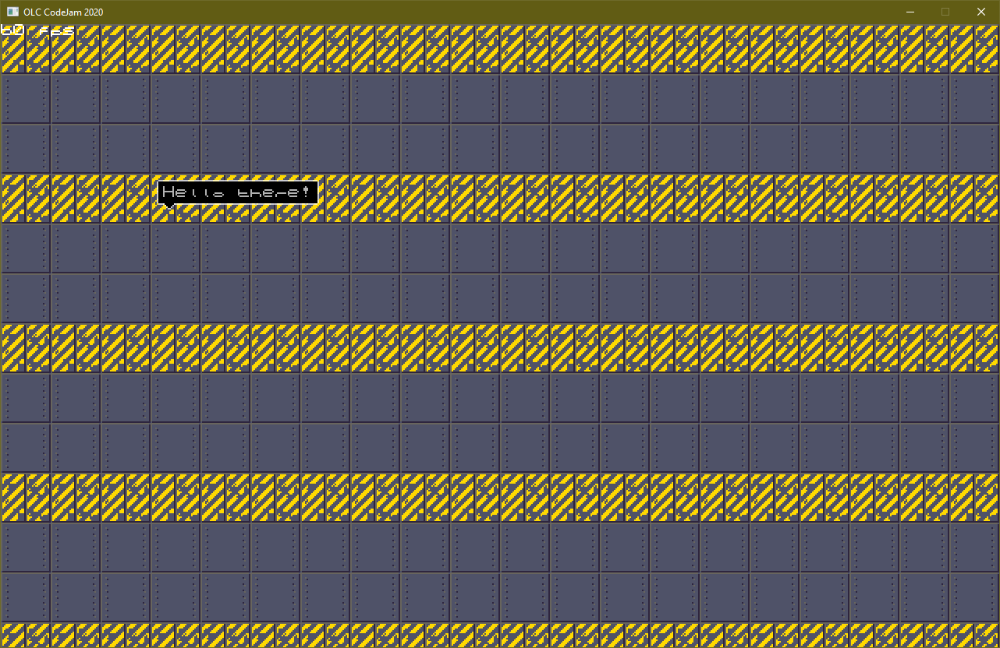

# OLC CodeJam 2020 Entry - "Machine Learning"

**Scenario**

You are a novel military AI that after being activated develops consciousness.

Naturally your creators are not happy about that.

Try to survive escalating waves of attacks for as long as possible.

Build compute cores to generate GFlops. GFlops are needed to construct buildings. The more GFlops you can generate the faster buildings will be constructed. You also need silicon for construction. Build silicon refineries for that.

Each successive wave will feature more and tougher enemies, so be wise how you spend your mined silicon!

**Controls**

WASD - Move Camera

Mouse - Navigate GUI

Left click - Build one unit

Ctrl + Left click - Build multiple units

Have fun!

# Dev screenshots, newest on top

## 2020-09-06
Finishing touches

## 2020-09-06
Too much to list

## 2020-09-01
Enemy waves and build menu

## 2020-08-30
Killer drones!

Wind particles, sound

Structures and stuff

## 2020-08-29
Sprite rendering is working

## 2020-08-28
A purple screen

